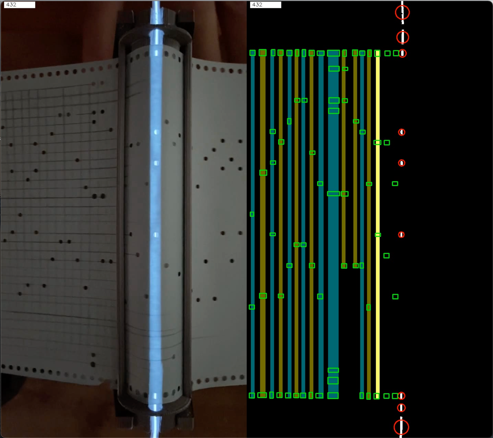

<!-- 20220113-MC-journal-rows-vis.md -->

## 2022-01-13: Row detection and visualization redux

I've had a bit of a hiatus from the project over Christmas, and it's also taken me a while to get my head around the processing needed to group traces (see 2021-11-26 journal entry) into rows corresponding to codes punched in the Monotype tape.

If the data were perfectly clean and regular, it would be relatively easy, but allowing for tape skew, small camera movements and most of all wide variations in the speed that the tape moves over the reader bar, but these factors all mean that a simplistic analysis is likely to be fooled by unexpected variations.  Ultimately, any analysis can be thrown if the source data is sufficiently distorted from what is expected;  as they say "Garbage In, Garbage Out".   But as long as there is enough data (which in this context means sufficient video frames for each row of holes passing over the reader bar), I'm hoping to design processing algorithms to do a decent job of extracting data from the tape.  The extra design and programming effort this entails is part of the original trade-off made when choosing a design strategy for reading the tape:  simpler hardware compensated for by "smarter" software.  (The original Monotype System didn't have this choice, and the mechanics of that system are a wonder to behold!  But way beyond my capabilities to replicate for this project.)

Without going into details, I believe I have now devised a reasonably robust process for detecting rows in the Monotype tape video.  The code will eventually be public in GitHub project [opencv-video-data-extraction
](https://github.com/gklyne/opencv-video-data-extraction/blob/main/video-06-row-detect.py).  Look for function `trace_row_detect` and class `region_trace_set` for the central logic used for row detection.  I fully expect the details to be revised as the project progresses, so this link will not necessarily reflect the latest version.

### Video data processing

My various experiments with video data processing are leading me to think more broadly about the nature of computer vision.  As [noted previously](./20211101-MC-journal-temporal.md), I might have used machine learning to figure out how to extract data from the video, but that would have required access to a significant body of labelled video data, something that I don't have.  So it comes down to me to figure out how to process the video data.

It became evident early on that the processing would take the form of a pipeline, with each step in the pipeline reducing the data and passing results to the next step.  Early pipeline steps dealing with pixel-level data would need to be optimized for speed because of the sheer number of pixels present in a video.  So, as far as possible, the early processing stages use optimized functions in the [OpenCV](https://opencv.org/about/) library.  Later pipeline steps working with higher level concepts are implemented in code that I am writing in the [Python language](https://www.python.org/).

So far, the processing pipeline looks something like this:

1.  Read video.

    The result is frame-by-frame pixel data, where each pixel is an RGB colour value.

2.  Detect highlight regions (mostly consisting of holes in the tape passing over the reader bar, but also some extraneous regions).

    The result is frame-by-frame pixel data, where each pixel is a binary (on/off) value

3.  Highlight region detection, where adjacent pixels are merged into regions.

    The result is frame-by-frame region descriptions, where each region has calculated centroid coordinates derived from the constituent pixel coordinates.

4.  Filter obviously spurious regions, to speed up subsequent processing

    The result is still frame-by-frame region descriptions.

5.  Trace detection, where a "trace" represents a nominally stationary region through multiple frames.  The intent is that each trace corresponds to a hole in the tape being drawn over the reader bar.

    The result is a list of trace descriptions, approximately ordered by their appearance in the video (specifically, ordered by the video frame in which the trace ends).  Each trace description records its starting and ending frames, and its spatial location within those frames.

6.  Row detection, where each row consists of traces grouped into sets that overlap temporally.  The intent is that each row represents a row of holes being drawn over the reader bar, and while there may be some variation in the timing of their detection, it is assumed that there will be at least one video frame in which all holes in a row are detected together.  Detection is complicated by the fact that rows may overlap, and in such cases the software needs to decide the row to which each particular trace should be assigned.  Also, there will be some spurious traces that could not be reliably eliminated in step 4.

    The result is a list of row descriptions, where each row consists of a set of traces, approximately ordered by their appearance in the video.

7.  The next step, which has not yet been implemented, will be to analyze the traces in each row, and decide which of the possible holes in the Monotype tape they correspond to; i.e. to extract a punched tape code for each row.  This will need to take account of the fact that there may still be spurious traces in some rows, and some holes (particularly sprocket holes) sometimes fail to be detected in earlier processing steps.

This notional processing pipeline is itself the result of some trial and error from working with the data.  It has occurred to me that choosing appropriate intermediate processing steps is a substantial part of designing the overall video analysis process.  It has further occurred to me that choosing useful intermediate representations is a big part of what deep neural network learning is able to automatically achieve from its input data.  The adjective "deep" here refers to multiple intermediate layers of representation that are inferred from processing the raw input data.   So in some ways, this process of experimentation with data and pipeline alternatives might be regarded as analogous to how deep learning operates.

### Visualization

For me, an interesting aspect of this work has been thinking about how to visualize data that is being extracted from the video.

Unlike a deep learning network where intermediate representations are hidden and largely not amenable to human interpretation, my approach requires gaining knowledge of the characteristics of each of the intermediate representations, so that I can judge what processes might be effective in moving towards the end goal of decoding data from the type.  When dealing with large amounts of data, visualizations are very helpful towards this end.

A notable feature of the processing pipeline is that processing moves from being primarily spatial (describing features in terms of their positions of within a video frame) to temporal (describing features in terms of when they appear in the video).  Ultimately, what we need to describe is neither temporal, or spatial, but a sequence of yes/no values corresponding to each hole position across the Monotype tape.

I have been devising visualizations with the primary aim of showing me how the algorithms are handling the video data presented, showing results from steps 1, 2, 3, 5 and 6 of the processing pipeline (see above):

The screenshot of a single frame of the visualization video shows the original video side-by-side with results from the processing pipeline:

- The original video (step 1) is shown in the left half of the display.  The video frame number is shown at the top.

- the highlighted areas (step 2) are shown as white areas in the right half of the display.

- merged highlight regions (step 3) are shown as red circles, centred on the region centroid and with area proportional to the actual area of the region.

- traces (step 4) are shown as green rectangles.  The position is based on the region centroid, but with the horizontal position offset so that older traces move away to the left. The width of the rectangle is based on the duration of the trace (in video frames), and the height is adjusted so that the area of the rectangle matches the area of the region summed over all of the frames in which it appears.  The effect of this is that traces that appear for longer in the video (e.g., when the tape is moving more slowly) are wider in the visualization.  This is the first step in which the visualization moves from being entirely position-based to becoming both position- and time- based.

    (This visualization could be made to look more like the original video by offsetting the vertical position using a function of the frame number so that the trail of traces appears to recede into the background.  Reducing the brightness of the trace outline might also add to the receding effect.  There are many ideas that could be tried here.)

- detected rows (step 6) are shown as vertical bars that overlap the traces that have been grouped into rows.  The vertical position and height of the bars is calculated to cover all of the traces.  The width of the bar is calculated to cover the duration for which all of the traces are present in the video (so a very narrow bar might indicate one or more of the traces being present for a very short period, or some of the traces starting and stopping sooner or later than the others).

    The alternative colours of the row bars are mainly to make it easier to distinguish successive rows, but also highlight when the row detection order occurs out of sequence with their position on the tape.  So, for example, the screenshot shows two blue-ish bars adjacent on the display.  One of these bars is noticeably wider than the other.  This is due to the way that row detection works:  when the traces in a row have longer duration (here due to a brief pause in the speed of the tape), the algorithm waits longer (i.e., looks further ahead in the data) to ensure that no subsequent traces will be added to this row.

These explanations are intended to show how the visualizations presented are not entirely arbitrary (even if they contain some arbitrary choices), and their creation owes little to aesthetics.  Yet feedback from others involved with the project suggests that they are visually interesting in their own right, which maybe hints at the possibility of a previously unplanned "Monotype Composition" arising from Clarice's diary?

This visual interest suggests a further question:  is this visual interest somehow related to capturing significant features of the underlying data and the processes?  Are our human perceptual capabilities somehow catching these underlying processes and drawing our attention to them, even if we are not formally aware or able to articulate what is being presented?  And, if so, can  we exploit this effect to create more artifacts that reflect other underlying information patterns in artistically compelling ways?  In a sense, I think, such explorations lie at the heart of the Monotype Compositions project.

### Glossary

In writing these journals, I'm realizing that I need to use some words with quite particular meanings within this project:

- **Monotype tape**: a paper tape produced by the Monotype system Keyboard.  The tape is about 110mm wide, and has 31 hole positions across its width, as well as sprocket holes on each side.  The sprocket holes are present in every row; other holes are present or not present according to the character or end-of-line control being encoded.

- **Tape reader**: is a physical device designed and constructed to record a video of a _Monotype tape_ being drawn over a _reader bar_.  Data encoded as holes in the tape is extracted by software that analyzes the recorded video.

- **Reader bar** or **reader bridge**: a part of the _tape reader_ that illuminates successive rows of holes in a Monotype tape.  The tape holes passing over the reader bar appear in the recorded video as bright regions, the position and timing of which is analyzed to extract the tape-encoded data.

- **Highlight region** - or **marker**: a bright region in the recorded video that is seen when holes in a Monotype tape pass over the reader bar.  There may be other spurious highlights that show up in the video - part of the task opf the analysis software to to distinguish these from actual hole data, and discard them.

- **Centroid**: the computed centre of a region in a single frame of video.  This is a kind of average position over all of the pixels that make up the region, and is used as an estimate of the position of the centre of a hole pouched in the tape.

- **Trace**: the appearance of a single _highlight region_ in several successive frames of a video.  Each hole passing over the reader bar is expected to be visible for several frames, and thus represented as a trace.

- **Row**: a set of _traces_, each corresponding to a single hole in a Monotype tape, that correspond to a single character or control code encoded in the tape.

