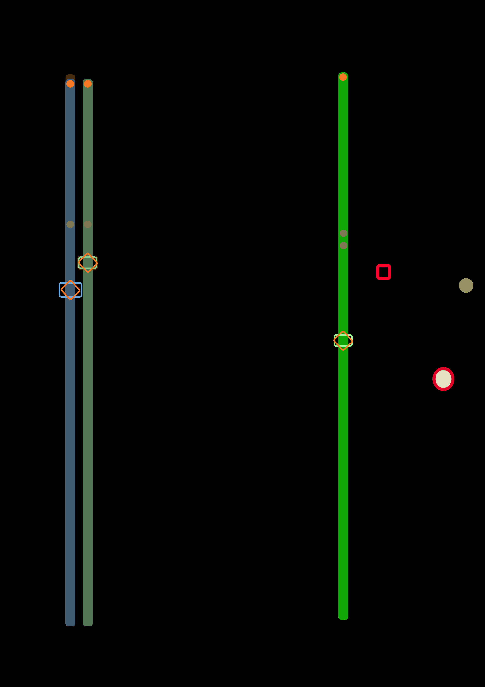

<!-- 20230615-Journal-data-decode-and-new-colours.md -->

The previous journal post focused on improvements to the reader hardware and software over the preceding year.  This post focuses on some new developments in the software, many as a result of a meeting with Dawn.

## Revised colours for analysis pipeline visualization

The colours originally used for the video analysis pipeline visualization were chosen arbitrarily, with the only concern being that they were sufficiently visible to support pipeline diagnostic activities.  So rather lacking in aesthetic qualities.

Observers have commented that the visualization may itself be an(other) artistic output of the project.  As such it seems appropriate to include aesthetic and artistic considerations in the choice of colours, and how they might relate to the broader context of the Monotype Compositions project.

Dawn and I held a meeting in early June 2023, during which Dawn surfaced the role of colour in Clarice's diary.  While there are relatively few explicit references to colour, there are plenty of contextual references with associations to colours that would have been in use:  notably, the Red Cross, colours used in armed forces and medical uniforms.  Where possible, Dawn located archive photos of these items of the web, and took digital colour samples from them.  These were used to create a [mock-up palette of colours](./Decoder-colours.png) corresponding to the different functional elements of the analysis pipeline visualization.

<!--

-->

Subsequently, I refactored the video analysis code to separate out the colour definitions, and used colours from the mock-up when generating the video.  These colours can be seen in the most recent video from processing the diary introduction page (`20230416-IMG_3082-intro-output_3.m4v`).

The colour table used is:

    # Colours linked to Clarice's diary
    COLOUR_MARKER           = Colour_val(R=90,  G=88,  B=76)    # Bright pixels (white)
    COLOUR_CENTROID         = Colour_val(R=80,  G=17,  B=19)    # Region centroid (red)
    COLOUR_FREE_TRACE       = Colour_val(R=90,  G=20,  B=20)    # Trace not allocated to row (green)
    
    COLOUR_NEW_BORDER       = Colour_val(R=60,  G=96,  B=57)    # Light green (Unused?)
    COLOUR_NEW1_ROW_FILL    = Colour_val(R=6,   G=65,  B=5)     # Odd rows: Neutral green
    COLOUR_NEW1_ROW_TRACE   = Colour_val(R=60,  G=96,  B=57)    # Odd rows: Bright green
    COLOUR_NEW2_ROW_FILL    = Colour_val(R=6,   G=65,  B=52)    # Even rows: Neutral green
    COLOUR_NEW2_ROW_TRACE   = Colour_val(R=60,  G=96,  B=57)    # Even rows: Bright green
    
    COLOUR_OLD_BORDER       = Colour_val(R=100, G=100, B=100)   # White (Unused?)
    COLOUR_OLD1_ROW_FILL    = Colour_val(R=25,  G=36,  B=45)    # Dull blue
    COLOUR_OLD1_ROW_TRACE   = Colour_val(R=45,  G=67,  B=87)    # Medium/bright blue
    COLOUR_OLD2_ROW_FILL    = Colour_val(R=33,  G=47,  B=33)    # Dull green
    COLOUR_OLD2_ROW_TRACE   = Colour_val(R=55,  G=80,  B=55)    # Medium/bright green
    
    COLOUR_SPROCKET         = Colour_val(R=97,  G=47,  B=14)    # Orange
    COLOUR_HOLE             = Colour_val(R=97,  G=47,  B=14)    # Orange
    COLOUR_HOLE_POS         = Colour_val(R=50,  G=50,  B=33)    # Dull olive
    COLOUR_HOLE_LABELS      = Colour_val(R=60,  G=60,  B=40)    # Light grey

(It occurred to me subsequently that the colours might also be interpreted as reflecting more gruesome aspects of the context that Clarice was dealing with: the white marker a flash of munitions, the red circle an initial injury, the red traces the resulting wounding and bloodshed, subsequent rows representing a process of putting the pieces back together into a more-or-less functioning person, and some that don't survive the wounding, and just die.)

## Monotype data decoding

Previous iterations of the analysis software have focused on the raw data on the tape, the presence or absence of punched holes and where they occur.  For this purpose, it was sufficient to simply number the rows `0` to `30` (counting from zero being a computer programming thing).

But now we have the data, it's natural to ask what it means, particularly in terms of its relationship to the printed diary.  The Monotype system assigns a code to each hole position across the width of the tape (which I refer to as columns).  Most of these codes relate to a row- or column position in the type matrix used (see below), and two others are related to spacing and end-of-line information.

<!--

-->

The decoding software has been enhanced to show the Monotype column labels, both in the video and in the output data.  Further, the output data created includes indication of the corresponding character (where possible) that would be printed when using the Monotype Bulmer 469 matrix layout, this being used for typesetting and printing Clarice's diary.  Here is a short excerpt from the data decoded from the diary introduction:

    row 3000: frame 20732, data | -------O-- ---------- --O------- - |  (G,7       )  o
    row 3001: frame 20739, data | -------O-- --------O- ---------- - |  (G,3       )  r
    row 3002: frame 20745, data | ------O--- -------O-- ---------- - |  (H,2       )  t
    row 3003: frame 20752, data | -------O-- ---------- ---O------ - |  (G,8       )  n
    row 3004: frame 20758, data | ---------- O-------O- ---------- - |  (E,3       )  I
    row 3005: frame 20764, data | ---------- O------O-- ---------- - |  (E,2       )  -
    row 3006: frame 20770, data | ---------- O------O-- ---------- - |  (E,2       )  -
    row 3007: frame 20777, data | ---------- ---O------ ------O--- - |  (C,11      )  E
    row 3008: frame 20784, data | --------O- ---------- O--------- - |  (F,5       )  S
    row 3009: frame 20791, data | ---------- -O-------- -------O-- - |  (D,12      )  R
    row 3010: frame 20798, data | ------O--- ---------- --------O- - |  (H,13      )  U
    row 3011: frame 20805, data | --------O- ---------- --------O- - |  (F,13      )  N
    row 3012: frame 20811, data | -------O-- -------O-- ---------- - |  (G,2       )  
    row 3013: frame 20817, data | ---------- ---O------ --------O- - |  (C,13      )  D
    row 3014: frame 20824, data | ---------- O--------- -------O-- - |  (E,12      )  A
    row 3015: frame 20830, data | ---------- ----O----- -------O-- - |  (B,12      )  V

The data shows a tape row number, a corresponding video frame number (useful for cross-referencing the generated visualization video), a visual pattern of holes punched in that row, labels for the punched holes, and finally an indication of the corresponding character.  Note that the tape is read in a reverse direction, from the end to the start of the typeset text, so the actual decoded characters in the data would read from the bottom upwards.

